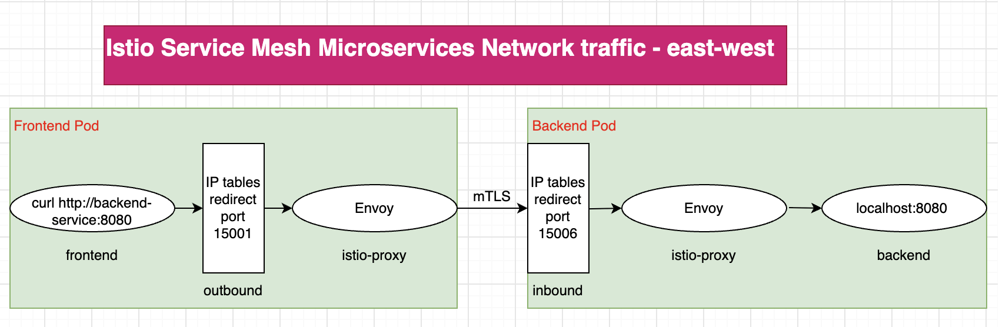

# eks-istio-microservice-cd
In this demo, I will show you how to use istio for the service mesh

## Microservices work with sidecar Istio

check the continers

kubectl get pod backend-v1-9f77d8dfd-q7kqz -n istio-lab -o go-template='{{range .spec.initContainers}}{{.name}}{{"\n"}}{{end}}{{range .spec.containers}}{{.name}}{{"\n"}}{{end}}'
istio-init
istio-proxy
backend

kubectl get pod frontend-9c484f574-dbbrt -n istio-lab -o go-template='{{range .spec.initContainers}}{{.name}}{{"\n"}}{{end}}{{range .spec.containers}}{{.name}}{{"\n"}}{{end}}'
istio-init
istio-proxy
frontend

allen@maxwell ~ % curl -i  k8s-istioing-istioing-28d8b99c40-32680248.us-east-1.elb.amazonaws.com
HTTP/1.1 200 OK
Content-Length: 148
Connection: keep-alive
Content-Type: application/json
Date: Thu, 27 Aug 2026 04:51:57 GMT
Keep-Alive: timeout=4
Proxy-Connection: keep-alive
Server: istio-envoy
X-Envoy-Upstream-Service-Time: 8

{"backend_response":{"message":"Hello from Backend!","pod":"backend-v2-6d99c945dc-hnlg9","version":"v2"},"frontend_pod":"frontend-9c484f574-dbbrt"}

