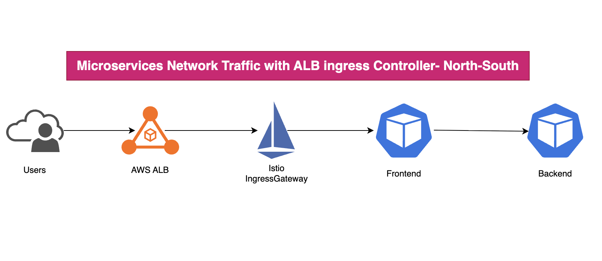

# eks-istio-microservice-cd
In this demo, I will show you how to use istio for the service mesh, I will install istio on EKS and also use the AWS ALB with target-type IP and created routing and virtual services. For the backend service will be two versions with canary release integrated for test.


## Network traffic North and South




## Microservices work with sidecar Istio


## Usage

Install istioctl
```shell
brew install istioctl
```

Use helm install istio
```shell
helm repo add istio https://istio-release.storage.googleapis.com/charts
helm repo update
```

Helm install istio-base

- create name space for istio
```shell
kubectl create namespace istio-system
```

- start to install istio-base
```shell
helm install istio-base istio/base -n istio-system --wait
```

Install istio control panel - istiod

```shell
helm install istiod istio/istiod -n istio-system --wait
```

Install IngressGateway 

- create namespace for ingressgateway
```shell
kubectl create namespace istio-ingress
```

- Install istio-ingress
```shell
helm install istio-ingress istio/gateway -n istio-ingress --wait
```

If your team does not want to use ALB to handle L7 traffic and want istio to handle L7 traffic then you can install NLB

then you need to create ingress-values.yaml
```shell
service:
  type: LoadBalancer
  annotations:
    service.beta.kubernetes.io/aws-load-balancer-type: "external"
    service.beta.kubernetes.io/aws-load-balancer-nlb-target-type: "instance"
    service.beta.kubernetes.io/aws-load-balancer-scheme: "internet-facing" # or internal

```
then use the helm to upgrade the ingressgateway
```shell
helm upgrade istio-ingress istio/gateway -n istio-ingress -f ingress-values.yaml
```
check the continers
```shell
kubectl get pod backend-v1-9f77d8dfd-q7kqz -n istio-lab -o go-template='{{range .spec.initContainers}}{{.name}}{{"\n"}}{{end}}{{range .spec.containers}}{{.name}}{{"\n"}}{{end}}'
istio-init
istio-proxy
backend

kubectl get pod frontend-9c484f574-dbbrt -n istio-lab -o go-template='{{range .spec.initContainers}}{{.name}}{{"\n"}}{{end}}{{range .spec.containers}}{{.name}}{{"\n"}}{{end}}'
istio-init
istio-proxy
frontend

```

Test API calls for backend service
```shell
curl -i  k8s-istioing-istioing-28d8b99c40-32680248.us-east-1.elb.amazonaws.com
HTTP/1.1 200 OK
Content-Length: 148
Connection: keep-alive
Content-Type: application/json
Date: Thu, 27 Aug 2026 04:51:57 GMT
Keep-Alive: timeout=4
Proxy-Connection: keep-alive
Server: istio-envoy
X-Envoy-Upstream-Service-Time: 8

{"backend_response":{"message":"Hello from Backend!","pod":"backend-v2-6d99c945dc-hnlg9","version":"v2"},"frontend_pod":"frontend-9c484f574-dbbrt"}

```

